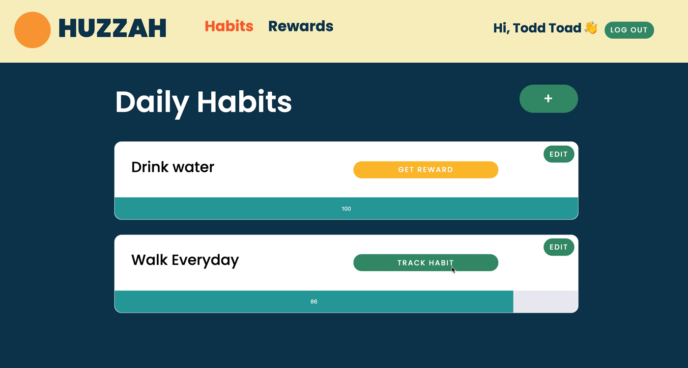

# Huzzah
Huzzah is a front end application that tracks your habits and rewards you for achieving those habits.

## Table of Contents
  * [Features](#features)

 

# Features
### Track Your Habits

Users can track their habits

### Add, Update, and Delete Habits

A user can add, update and delete habits. Each option renders a separate modal for each view.

### Add, Update, and Delete Rewards

A user can add, update, and delete rewards. Each option renders a separate modal for each view.

### Reward yourself

When a habit has been tracked 7 times, a reward button renders. Clicking the button takes them to the Huzzah! page where the user can claim their reward at any time.
